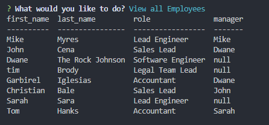

# Unit 12 MySQL Homework: Employee Tracker

The Employee Tracker uses Inquirer a long with a my SQL database to prompt the user the following

* Add Employee,
* View all Employees,
* Remove Employee,
* Add Department,
* View all Departments,
* Add Roles,
* View all Roles,
* Update Employee Role,
* Exit
```
The user can then choose one of the following to either view the roles, employees, or departments, or add new roles, employees, or departments. The user can also update their designated employee
```

# View All Employees
Viewing all employees grabs the name, role, and their corresponding manger




